# Ch18: Constituency Parsing, TreeRNNs

# 1. Motivation: Compositionality and Recursion

Compositionality

- word vector 이상의 더 큰 구절에 대한 고려의 필요성에 대해 생각해 볼 수 있다.
    
    사람들은 대개 이러한 큰 텍스트의 의미를 작은 요소들의 **semantic composition** 을 통해 파악한다.
    
- 언어는 recursive structure을 가지고 있다는 것은 cognitive하게는 논쟁 중인 영역이지만, 적어도 그렇다고 표현할 수 있을 것이다.

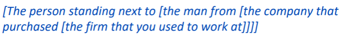

       🔼 가령 어떤 명사구는 더 작은 명사구를 포함하고, 그 안에도 더 작은 명사구가 있는 형태

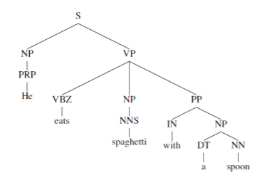

      물론 recursive의 정의대로 정확하게 무한하게 recursive하진 않고 nested라고 하고 싶을 수 있어도,          

conceptual 하게 recursive라고 할 수 있을 것!

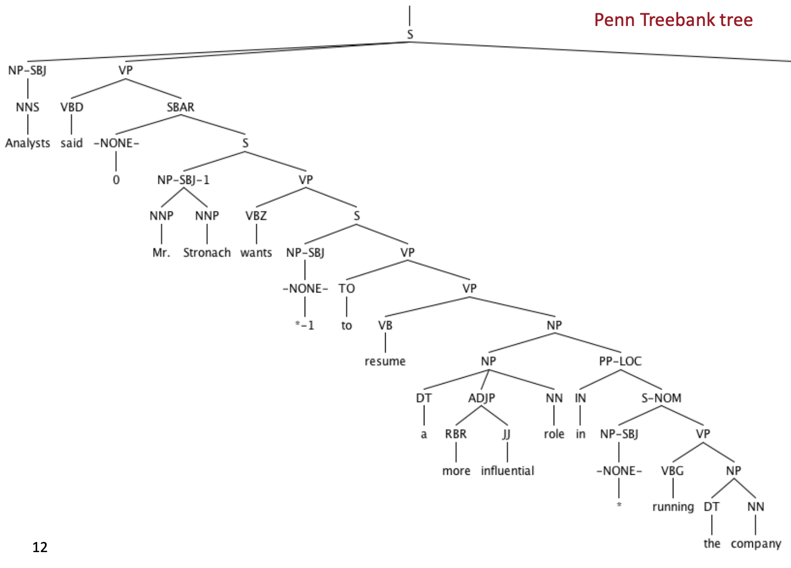

🔼 consistuency grammar (tree structure!) 

# 2. Structure prediction with simple Tree RNN: Parsing

How should we map phrases into a vector space?

기존에 word vetor을 벡터 스페이스에 매핑했던 것처럼, 더 긴 구절도 매핑해보자.

- meaning composition rule: 더 큰 constituent나 문장을 위해 upwards로 계산!

이 작업을 위한 두 단계를 생각해 보면, 

1. 문장 구조를 정확하게 다루기 위해 먼저 Parsing을 한다.
2. meaning computation을 한다.

> Tree구조가 기존 RNN과 다른 점
> 
> 
> 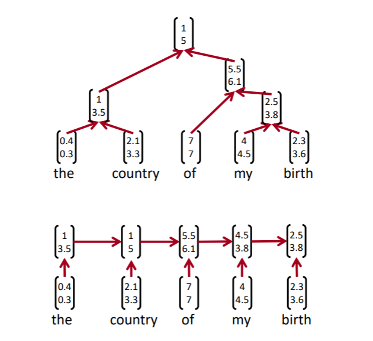
> 
> 기존 RNN도 어느 정도의 sequence를 반영하고 attention을 사용할 수 있지만, tree 구조는 더 분명하게 단어들이 구와 절을 이루는 과정을 반영하고, 따라서 syntatic structure에 훨씬 sensitive하다.
> 

Recursive Neural Networks for Strucrue Prediction 

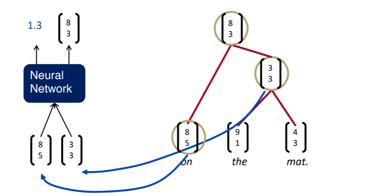

- 인풋: 두 개의 children representation
- 아웃풋 :
    1. ***(p)*** 두 개 노드가 병합될 경우의 semantic representation
    2. ***(score)*** 병합된 새로운 노드가 얼마나 그럴듯한지에 대한 점수(parse tree에서 좋은 constituent를 형성하는가)
    
    🔽 p 와 score 식
    

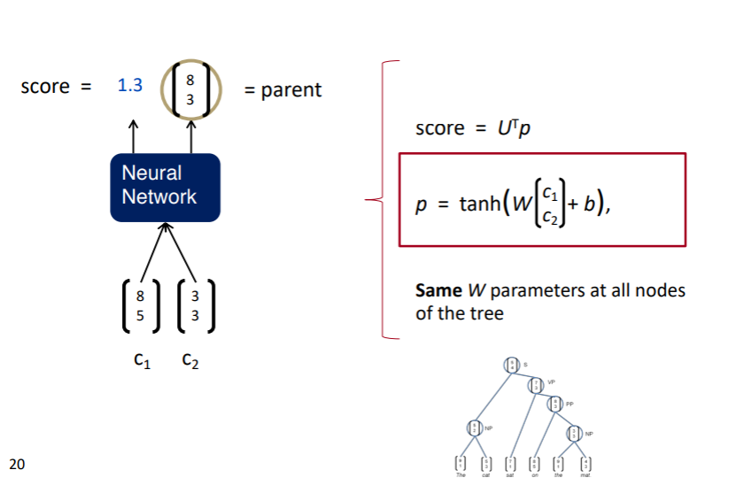

Parsing a sentence with an RNN(greedily)

- greedy parser
    
    전체를 검토한 뒤 가장 높은 점수를 가진 것부터 병합해서 계산해 나간다
    

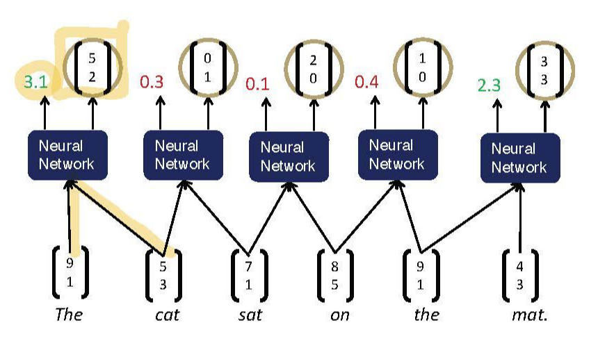

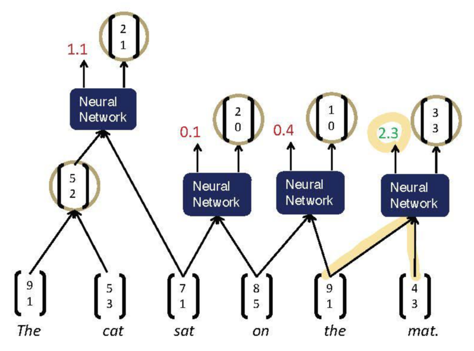

- Max-Margin Framework
    
    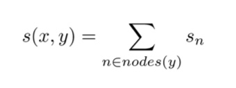
    
    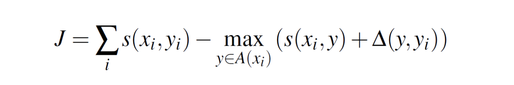
    
    기존에 존재하는 max margin objective function과 비슷한 형태인데, 여기에서 A(Xi)의 서치 구조가 greedy인 것이었음
    

# 3. Backpropagation Through Structure

- Goller&Kuchler(1996)
- 기본적으로 이전 강의에서 배웠던 내용과 비슷하다

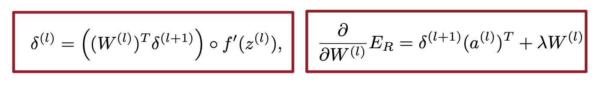

1. 기존  RNN에서처럼, 모든 노드에서 W의 미분값을 구해서 sum up
2. downward로 미분값을 split
3. parent로부터의 error와 노드 자신의 error을 더한다
- 2번이 기존  backpropagation 과조금 다른 점인데,
    
    forward propagation시에 parent node가 다음과 같이 2개 children node로 계산되므로
    
    
    
    back propagation시에 다음과 같이 각각에 대해 split해야 한다.
    
    
    

Discussion: Simple TreeRNN

- single matrix TreeRNN으로도 좋은 성과가 나오긴 했지만, 더 복잡한 상위의 composition을 다루거나 긴 문장들을 parsing하기에는 적합하지 않았다.
- 사실상 두 가지 인풋 사이에 interactoin 이 없다.
- 한 개의 weight matrix를 사용하므로 모든 syntatic categories, punctuaion 등에 대해 같은 composition funtion을 사용하게 된다

# 4. More complex TreeRNN units

Syntatically-United RNN (SU-RNN)

- 기본 syntactic구조의 backbone으로 symbolic Context-Free Grammar를 사용한다.
- 이에 따라 구분된 syntactic categories를 사용해서 composition matrix를 choose한다.
    
    즉 이전처럼 한 개의 universal한 matrix를 사용하는 것이 아니라, 컴포지션의 카테고리별로 다른 matrix를 사용한다.
    
    
    
- Compositional Vector Grammar (CVG)
    
    : PCFG + TreeRNN
    
    PCFG를 사용해서, Context-free Grammar를 사용하는 것 보다 더 빠르게 parse할 수 있다. 
    
- SU-RNN/CVG를 통한 학습에서의 weight matrix 시각화
    
    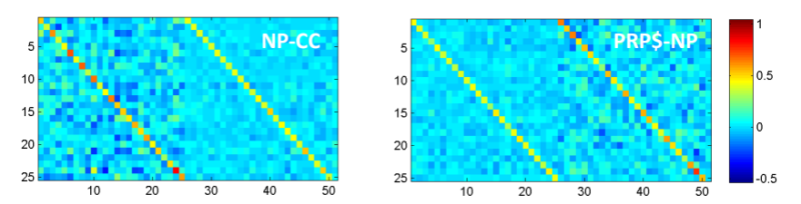
    
    의미적으로 중요한 것에 가중치가 크다. 
    

Compositionality Through Recursive Matrix-Vector Spaces (MV-RNN)

- 기존에는 아래 사진의 왼쪽과 같이 두 단어 벡터를 concat해서 weight matrix를 곱해주는 형태였다.
    
    하지만 어떤 단어는 그 자체로 의미를 가지기 보다 다른 단어에 어떤 작용을 하기도 한다.
    
    가령 “very good”의 “very”는 뒤 단어의 의미를 강화하는 operator 역할을한다. 
    
    이를 반영하기 위해 오른쪽과 같은 새로운 composition function이 제시되었다. 
    

- 미리 어떤 것이  operator인지 정하지 않고, 모든 단어와 구가 vector meaning과 matrix meaning을 가진다고 정한다.
    
    
    
    기존의 모델들과 마찬가지로 vector는 벡터끼리 concat되어 parent 노드의 벡터를 만들게 되고, matrix들은 concat되어 이를 처리하는 matrix와 곱해져 parent 노드의 matrix을 만들게 된다.
    
- 문제점
    1. matrix의 연산량이 커서 word vector의 차원을 적당히 줄여야 했다.,
    2. parent node의 matrix를 얻는 연산이 실제로 phrase를 얻는 과정을 연산하는 좋은 방법은 아니다.
    

Beyond the bag of words: Sentimental analysis

텍스트의 tone이 부정적인지, 긍정적인지, 중립적인지 판단하는 것

- Stanford Sentiment Treebank (데이터셋)
    
    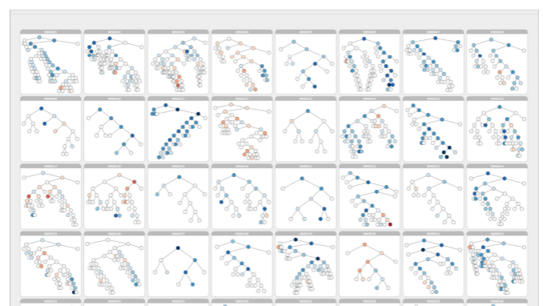
    
     문장의 긍/부정/중립 감정을 트리 구조로 label한다 → 각 단어와 구에도 감정이 부여됨
    
     모든 모델에서 이 데이터셋을 사용했을 때 성능이 높아졌다!
    

Recursive Neural Tensor Network

- 그렇지만 여전히 해결되지 않은  문제를 위해 neural tensor을 사용한 모델이 고안되었다.
    
    
    
- 두 벡터의 interaction 사이에 기존의 matrix 가 아닌 3d tensor를 사용해서 연산한다.
- 감정분석에서 반어법(negating negatives) 을 잘 반영한다

//

- 하나의 sequence computation 이 아니고 sentence마다 구조가 다르기 때문에 GPU연산 에 용이하지 않다.
- 물리학같은 분야에서 트리 구조가 용이하게 쓰인다!